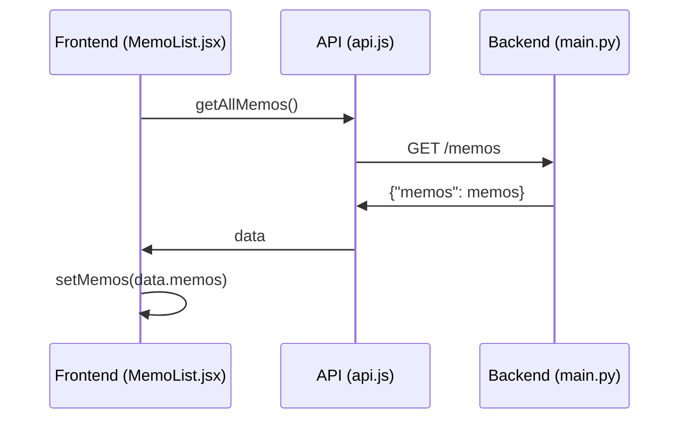

最初に
```
$ python3 -m venv .venv
$ .venv/Scripts/activate
$ pip install --upgrade pip setuptools wheel
$ pip install -r requirements.txt
```

backendの実行
```
$ cd backend
$ uvicorn main:app --reload --port 9000
```

APIのテスト
```
$ Invoke-RestMethod -Method GET -Uri 'http://127.0.0.1:9000'
$ Invoke-RestMethod -Method GET -Uri 'http://127.0.0.1:9000/memos'
$ Invoke-RestMethod -Method POST -Uri 'http://127.0.0.1:9000/memos' -ContentType 'application/x-www-form-urlencoded' -Body 'title=test title&body=test body'
$ Invoke-RestMethod -Method POST -Uri 'http://127.0.0.1:9000/memos' -ContentType 'application/x-www-form-urlencoded' -Body 'title=test title&body=test body&tags=greeting,test'
$ Invoke-RestMethod -Method GET -Uri 'http://127.0.0.1:9000/memos' -ContentType 'application/x-www-form-urlencoded' -Body 'title=test title&body=test body&tags=greeting,test'
$ Invoke-RestMethod -Method GET -Uri 'http://127.0.0.1:9000/search/keyword?keyword=test'
$ Invoke-RestMethod -Method GET -Uri 'http://127.0.0.1:9000/search/tags?tags=greeting,test'
```

frontend
```
$ cd frontend
$ npm install
$ npm run dev
```

## 📚学び

main.pyの方で
```
@app.get("/memos")
def get_all_memos(db: sqlite3.Connection = Depends(get_db)):
    memos = Get_all_memos(db)
    return {"memos": memos} ←/memosエンドポイントが返す形式
```
と実装していたら、(api.jsのgetAllMemo()で経由で)受け取ったデータを利用するときは、  
MemoList.jsxの方では 
```
const getAllMemosList = async () => {
        try {
            const data = await getAllMemos();
            console.debug('GET all memos success:', data);
            setMemos(data.memos || []); ←ココ
        } catch ......
```
と受け取らないと認識されない  
↓ gemini作



| 特徴           | formValue (Golang) | FormData (JavaScript) |
| :------------- | :------------------- | :---------------------- |
| 役割           | 個々のフィールドの値の取得 | フォーム全体のデータの構造化と送信 |
| データ型         | 文字列               | 多様なデータ型（テキスト、ファイルなど） |
| エンコード形式     | 通常は application/x-www-form-urlencoded | multipart/form-data       |
| 複数値のサポート | 最初の値のみ         | 複数の値を扱える          |
